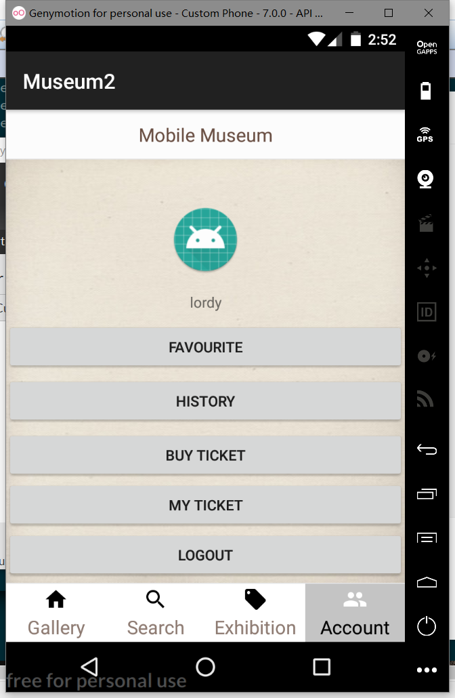
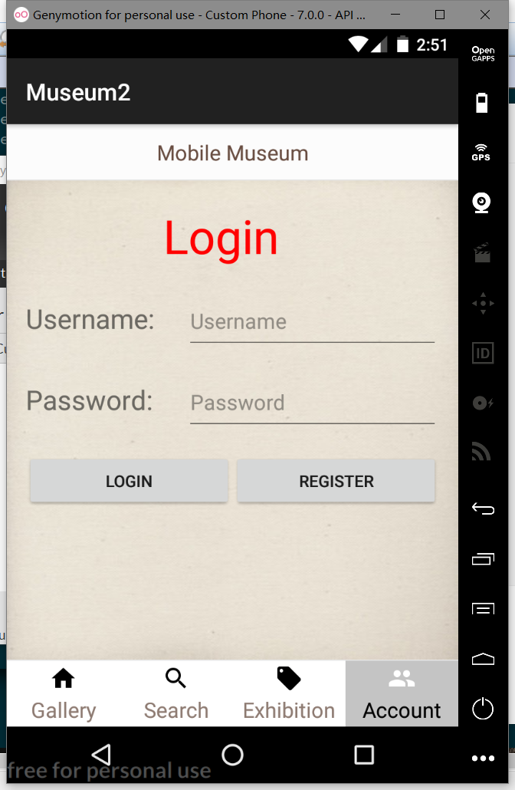
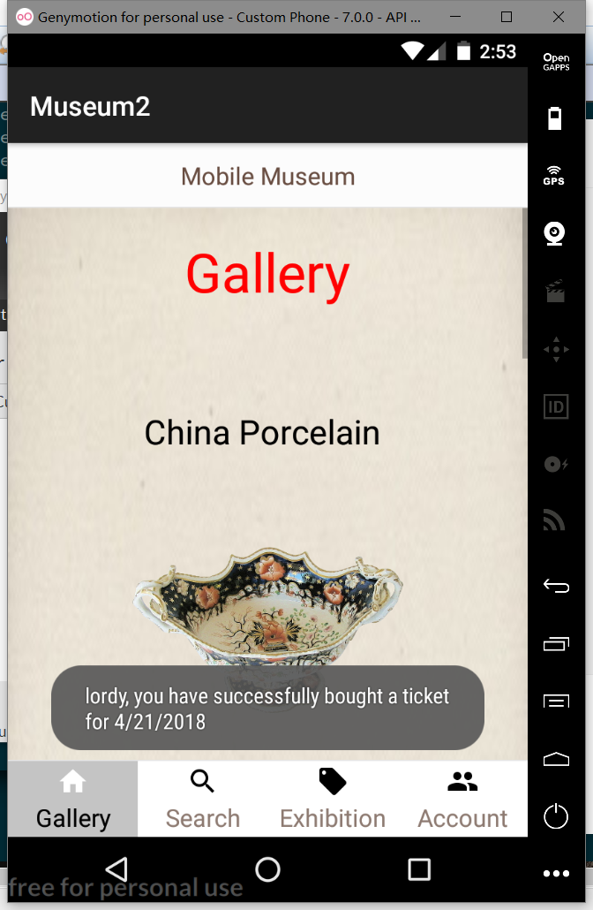

# This is a readme file for Mobile Museum App.

## **User Manual**

### **Introduction**
Mobile Museum App is an app designed for not only big fans of antiques, but also those people who are interested in anticent culture but not familiar with it yet. From using this app, you can browse in the sea of paintings, sculptures and other ancient items.  
In this app, you can check items randomly recommended by the museum and get familiar with more and more historical works. Detailed information of the item will also be presented when being clicked. Item serach function is used to search for items with specific key words. 'Exhibition information' will provide detailed description of the recent exhibitions held in the museum. Even more exciting functions will be provided if you register an user account in this app.  
More detailed description and instruction of each function will be listed below.  

### **Main page**
When open this app, you will see the well-designed UI main page of our app. There are four basic fragments on the main page.   
- Gallery: On this page, randomly picked items recommended by the museum will be presented.  
- Search:  This is the place where the user can search for items using key words.  
- Exhibition information: All detailed information about the recent exhibitions will be listed here.  
- Account: User can simply register an account and enjoy more convenient functionalities provided by Mobile Museum App.  

  

### **Gallery**
On the 'Gallery' page, user can browse over randomly recommended items. Those items are presented with their names and pictures. You can scroll up and down to see all the recommended items. If you are interested in a specific item, you can simply click on it and the page will be replaced with an item presention page, with detailed introduction including its author, history and background story.  
After checking out the item, you can click on 'return' button to go back to the Gallery page.  
If you are not interested in any of the recommended items, you can scroll down to the bottom of this page and click on the 'Refresh' button. This action will refresh the recommended items and you will be presented another set of items that are different from each other.  
   

### **Search**
On the 'Search' page, you are able to search for specific items using key words. For example, if you are interested in 'bronze mirror' and you really want to know more about it, you can type in 'bronze mirror' and click on the search button. 
If there are corresponding item in the museum database, then the searching results will be listed under the searching bar.  
Also, our searching function supports ambiguous searching, so you can still get the searching result even when you only know part of its name.  

### **Exhibition**
On the 'Exhibition' page, you will be informed of the recent exhibitions held in the museum, with the name and topic.  
If you are interested in one of them, just click on the figure and a brief introduction of it will be presented to you.  

### **Account**
Mobile Museum App provides various types of functions especially for those registered user. 
Simply register for Mobile Museum App and enjoy all of these amazing functions including having a favorite folder, 
viewing history of searching and looking at personal ticket information.  

#### Register
If you do not have an user account yet, try to register one. Click on the 'Register' button on the page and it will lead you to the register page.  
In this page, you will need to specify your username, user email and password. The username can not be the same as an existing one and must start with letters. The user email must be in correct form of an valid email. After finishing, click on the register button and you will have your own user account.  

#### Login
After register, you will be able to login to your account using your username and password.  

#### Favourite folder
When you login to your account, you will see the user account page. There are several functions in it and they are all practical and easy to use.  
The first one is the favourite folder. The favourite folder will include all the items you like in case that you may want to see them again.  
Choose the items you like in whichever pages presenting items with a simple click on the topright star button. Go back to your favourite folder and you will find that it is already there.  
If you do not want to see some items in this folder, just click on the star button again and refresh the folder. Then, the item will be removed from the folder.  

#### History
The 'History' folder will list all the items you have checked. The results will be sorted by the time you visited the item.  
If you want to clear the history, just click on the 'clean' button and all your browsing history will be cleaned up.  

#### Buy tickets & My tickets
In this page, you can buy tickets of the museum. You will need to go through the following steps:
1. choose a date;
2. type in your account number and CVV code;
3. type in your real name;

After checking the information you provided above, you will be able to get the tickets you want.  
To check the tickets you have bought, you can enter into 'My tickets' to view your booking. The page will list all the tickets you have bought with their detailed information, including date and the verificatino code provided by the museum. You will get access into the museum after you show this code to the museum officials.  

  
   
## **Support Manual**
### **Introduction**
This file is a support manual for developers of Mobile Museum App. Mobile Museum App is an app designed for users who want to know more about the collections in museum. It can also be used as a method to propagate the museum.  
### **Installation and Configuration**
#### Front-end (Android app):
1.	Unzip MobileMuseum_final.zip, and use Android Studio to open the project.
2.	Note that as the back-end will be run on a different machine from the developers’, the server’s addresses used to send request to the server which are coded in the .java files of the app have to be changed.
To alter the server’s addresses, check the top of the outer-class of each .java file and find static final String type variable named as “xxxxxxURL”. For example, in FavoriteItems.java, the original server’s address used for getting favorite item names is:
http://vcm-538.vm.duke.edu:8000/mobile_museum_server/getFavoriteItemNames/
if the server is run on a different machine, then the URL should be changed to:
http://&lt;server address&gt;:8000/mobile_museum_server/getFavoriteItemNames/
3.	Change all corresponding URLs in every .java file, then after the server has started, build and run the app.
4.	Change the packet name of each .java file properly to the specific name of user's.
5.	Also note that during the testing, it is observed that the emulator embedded in Android Studio does not have a good runtime performance, for better emulation performance, Genymotion (for personal use) is recommended.

#### Back-end (Django server):
1.	Unzip mysite.zip and enter directory “mysite/”.
2.	Use command below to start the back-end server:
python3 manage.py makemigrations && python3 manage.py migrate && python3 manage.py runserver &lt;server address&gt;:8000
Note that the server is built based on Django Web framework and PostgreSQL, to make sure the server will function normally, python3, PostgreSQL as well as Django should be properly installed.
Also note that the server address is the name of the machine which runs the server, for example, for the original developers of this app, the command will be:
python3 manage.py makemigrations && python3 manage.py migrate && python3 manage.py runserver vcm-538.vm.duke.edu:8000
3.	If the server is successfully started, the network traffic as well as HTTP requests sent to the server can be monitored from the terminal, for example:  

### **Overall structure of code**

#### Front-end (Android app):

The app consists of 17 Activities/Fragments. Here are their brief introductions:

- **MainActivity:** activity used as the starting activity, which creates and manages four different fragments representing gallery, search, exhibition and account pages respectively;

- **MyFragmentPagerAdapter:** A fragment pager adapter used to manage different fragments;

- **MyFragment1:** a fragment used to present gallery page, display randomly recommended items and their images by interacting with the server and getting information from the database;

- **MyFragment2:** a fragment used to present search page and display searching results by interacting with the server and getting information from the database;

- **MyFragment3:** a fragment used to present exhibition page by interacting with the server and getting information from the database;

- **MyFragment4:** a fragment used to present account page when the user is not logged-in;

- **MyFragment5:** a fragment which is deprecated;

- **LoginActivity:** a fragment used to present account page for user to entering the username and password, namely doing the authentication by interacting with the server;

- **RegisterActivity:** a fragment used to present account page for user to register a new account;

- **PersonalInfoActivity:** a fragment used to present account page when user is already logged-in. The page will display a menu (by interacting with the server) including: username, favorite folder, browsing history, ticket purchasing, purchased ticket information and logging out;

- **Cookie:** an application used to implement the cookie sent along with HTTP request which is used as the status of user’s session and to maintain its logging in status;

- **ItemPresentation:** an activity used to display the detailed information of an item, it also manages “favorite” operation and update favorite folder by interacting with the server and getting information from the database;

- **ExhibitionPresentation:** an activity used to display the detailed information of an exhibition;

- **FavoriteItems:** an activity used to manage and display the favorite items list;

- **History:** an activity used to manage and display the browsing history list;

- **BuyTicket:** an activity used to manage the ticket purchasing activity;

- **Ticket:** an activity used to manage display the purchased tickets information;

#### Key APIs into the back-end:

- **private class ItemInfo (extends AsyncTask class):** class which contains asynchronized method to send HTTP request to the server and get specific item’s detailed information indicated by the item’s name sent;

- **private class ItemImage (extends AsyncTask class):** class which contains asynchronized method to send HTTP request to the server and get specific item’s image indicated by the item’s name sent;

- **private class addFavoriteItem (extends AsyncTask class):** class which contains asynchronized method to send HTTP request to the server and add specific item’s name to user’s favorite items list (i.e. corresponding data table);

- **private class removeFavoriteItem (extends AsyncTask class):** class which contains asynchronized method to send HTTP request to the server and remove specific item’s name from user’s favorite items list (i.e. corresponding data table);

- **private class getFavoriteItemName (extends AsyncTask class):** class which contains asynchronized method to send HTTP request to the server and get a list of favorite items’ names from the database;

- **private class updateHistory (extends AsyncTask class):** class which contains asynchronized method to send HTTP request to the server and update user’s viewing history (i.e. add newly viewed items name to corresponding data table);

- **private class getHistory (extends AsyncTask class):** class which contains asynchronized method to send HTTP request to the server and get a list of newly viewed items’ names from the database;

- **private class Logging (extends AsyncTask class):** class which contains asynchronized method to send HTTP request to the server to let the server do the authentication using sent username and password;

### **Additional Files**

- **Mobile museum app requirement:** the document contains the detailed functional and non-functional requirements of the Mobile Museum app;

- **User story:** the document contains possible scenarios where the user will use mobile museum app and possible user operations when he/she uses the app;

- **Architecture:** the document contains the system architecture diagram;

- **Documentation plan:** the documents contains the detailed plan of this app project, including methodology, personnel and timing plan;

- **Mobile museum app project milestone presentation:** the document is the project milestone presentation slides.

- **Test plan:** the document contains detailed information of how the app will be tested including testing methodology, personnel and timing plan;

- **Project status report:** the document contains information of the progress of the project, including functions that has been finished, unfinished work, risk analysis and project reviews.
